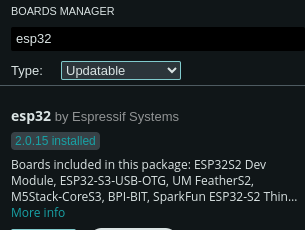

[](https://opensource.org/licenses/MIT)   [](https://www.crowdsupply.com/hw-media-lab/webscreen) [](https://www.crowdsupply.com/hw-media-lab/webscreen)


# WebScreen Firmware


WebScreen is an ESP32-based platform that allows users to run dynamic JavaScript applications using the Elk engine, LVGL for UI rendering, and an SD card for storing multiple JS apps. It supports secure HTTPS communication (with full chain certificates), BLE, MQTT, and more. If no JavaScript app is found on the SD card, a fallback notification app is used.

## Features

- **Dynamic JavaScript Execution**  
  Use Elk to run user-provided JS code stored on the SD card.

- **Configurable App Selection**  
  Specify the JavaScript file to run via a JSON configuration file (`webscreen.json`).

- **Rich UI with LVGL**  
  Draw labels, images, animations, charts, meters, and more.

- **Secure HTTP Requests**  
  Load a full chain SSL certificate from SD to connect to HTTPS APIs securely.

- **BLE & MQTT Integration**  
  Communicate with BLE devices and subscribe/publish to MQTT topics.

- **Fallback Mode**  
  If no JS app is found or configuration fails, a built-in fallback application is launched.

## Quick Start

### Hardware Upload via USB (JTAG Upload Port)

The board uses USB as the JTAG upload port. When using USB for uploading:
- **CDC_ON_BOOT** must be enabled so that serial port information is printed on USB.
- If the port isn’t detected (because USB is used for other functions), you may need to enter upload mode manually:
  - **Step 1:** With power off, press and hold the BOOT button (located behind the RST button).
  - **Step 2:** Connect USB.
  - **Step 3:** Press and hold the BOOT button, then press the RESET button and release the BOOT button.

### Arduino IDE

1. **Install ESP32 Boards**  
   In Arduino Preferences, under the Settings tab, add:  
   `https://raw.githubusercontent.com/espressif/arduino-esp32/gh-pages/package_esp32_index.json`  
   to the **Additional Boards Manager URLs**.
2. Click **OK**.  
3. Open the **Board Manager** via Tools → Board Manager, search for **ESP32**, and install the ESP32-Arduino SDK (version 2.0.3 or above).  

   
4. Copy all files from the repository’s **lib** folder into your Arduino libraries folder (see [manual installation instructions](https://docs.arduino.cc/software/ide-v1/tutorials/installing-libraries#manual-installation)).
5. In the Tools menu, select the correct board settings as shown below.  

   

## Configuration

The project uses an SD card file named `webscreen.json` to configure settings. An example file looks like this:

```json
{
  "settings": {
    "wifi": {
      "ssid": "ssid",
      "pass": "pass"
    }
  },
  "script": "timeapi_app.js",
  "last_read": 2
}
```

- The `"settings"` object holds Wi‑Fi credentials.
- The `"script"` key specifies which JavaScript file (e.g., `/timeapi_app.js`) will be loaded from the SD card.
- If the key is omitted, the default file `/app.js` is used.
- The `"last_read"` value is updated automatically on configuration reads.

## Building & Running

- **Compilation:**  
  The project is built with the Arduino ESP32 core. Ensure you have installed all required libraries (LVGL, SD_MMC, NimBLE, PubSubClient, etc.).

- **Runtime Modes:**  
  At startup, the firmware checks for the existence of the JavaScript file specified in `webscreen.json`. If found, it launches the dynamic JS environment; otherwise, it falls back to a default notification app.

- **Debug Output:**  
  All operations are logged to the serial console for troubleshooting (including Wi‑Fi, HTTPS connections, and JavaScript execution status).

## JavaScript API

The firmware exposes numerous functions to your JavaScript applications. Some highlights include:
- **Basic:** `print()`, `delay()`
- **Wi‑Fi:** `wifi_connect()`, `wifi_status()`, `wifi_get_ip()`
- **HTTP:** `http_get()`, `http_post()`, `http_delete()`, `http_set_ca_cert_from_sd()`, `parse_json_value()`
- **SD Card:** `sd_read_file()`, `sd_write_file()`, `sd_list_dir()`, `sd_delete_file()`
- **BLE:** `ble_init()`, `ble_is_connected()`, `ble_write()`
- **UI Drawing:** `draw_label()`, `draw_rect()`, `show_image()`, `create_label()`, `label_set_text()`
- **Image Handling:** `create_image()`, `create_image_from_ram()`, `rotate_obj()`, `move_obj()`, `animate_obj()`
- **Styles & Layout:** `create_style()`, `obj_add_style()`, `style_set_*()`, `obj_align()`
- **Advanced Widgets:** Meter, Message Box, Span, Window, TileView, Line
- **MQTT:** `mqtt_init()`, `mqtt_connect()`, `mqtt_publish()`, `mqtt_subscribe()`, `mqtt_loop()`, `mqtt_on_message()`

For a full list and examples of usage, see the [JavaScript API Reference](docs/API.md).

## Secure HTTPS Connections

To call secure APIs (e.g., using `http_get()`), load a full chain certificate stored on the SD card using:
```js
http_set_ca_cert_from_sd("/timeapi.pem");
```
### Creating a Full Chain Certificate
1. **Obtain Certificates:**  
   Collect your server certificate and the intermediate certificate(s). Optionally, include the root certificate.
2. **Concatenate Certificates:**  
   Use a text editor or command-line tool:
   ```bash
   cat server.crt intermediate.crt root.crt > fullchain.pem
   ```
   Ensure each certificate block starts with `-----BEGIN CERTIFICATE-----` and ends with `-----END CERTIFICATE-----`.
3. **Deploy:**  
   Copy the resulting `fullchain.pem` file to the SD card.
4. **Usage:**  
   Your JavaScript app should load it with `http_set_ca_cert_from_sd()` to enable secure HTTPS requests.

## Support & Contributions

- **Bugs & Issues:**  
  Please report issues or feature requests via the repository’s [issue tracker](https://github.com/HW-Lab-Hardware-Design-Agency/WebScreen-Software/issues).
- **Contributing:**  
  Contributions are welcome! See [CONTRIBUTING.md](docs/CONTRIBUTING.md) for guidelines.
- **Donations:**  
  If you find this project useful, consider donating or sponsoring the work.

## License

This project is open source. See the [LICENSE](LICENSE) file for details.
