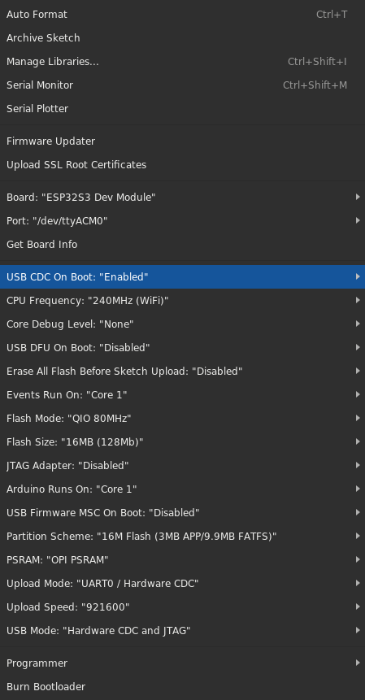

[](https://opensource.org/licenses/MIT)  [](https://webscreen.cc) [](https://www.crowdsupply.com/hw-media-lab/webscreen)

# WebScreen Software


WebScreen is a high-performance ESP32-S3 based platform for running dynamic JavaScript applications with advanced hardware features. The firmware provides a robust, modular architecture with comprehensive error handling, optimized memory management, and professional-grade logging systems.

## What's New in v2.0

- **Modular Architecture**: Complete refactor with separation of concerns
- **Advanced Memory Management**: Intelligent PSRAM/internal RAM allocation with leak detection
- **Comprehensive Error Handling**: Centralized error reporting with recovery strategies
- **Professional Logging**: Structured logging with multiple output destinations
- **Performance Optimized**: Hardware acceleration and optimized rendering pipeline
- **Power Management**: Intelligent power button handling and sleep modes
- **Enhanced JavaScript API**: Expanded API surface with better error handling
- **Developer Experience**: Improved debugging tools and comprehensive documentation

## Core Features

### Runtime Environment
- **JavaScript Engine**: Elk JavaScript runtime with comprehensive API bindings
- **Graphics Library**: LVGL integration with RM67162 AMOLED display support
- **Storage Management**: Robust SD card handling with multiple filesystem drivers
- **Fallback System**: Built-in notification app with scrolling text and GIF animation

### Hardware Integration
- **ESP32-S3 Platform**: Full PSRAM support and optimized memory allocation
- **RM67162 Display**: 536x240 AMOLED with QSPI interface and brightness control
- **Power Management**: Smart power button handling on GPIO 33
- **Storage Interface**: SD_MMC card support with robust initialization

### Networking & Connectivity  
- **WiFi Management**: Connection handling with timeout and status monitoring
- **Secure HTTPS**: Certificate chain validation with SD card certificate storage
- **MQTT Integration**: Client support with publish/subscribe functionality
- **BLE Support**: Bluetooth Low Energy stack integration

### Development Features
- **Modular Architecture**: Separated concerns across hardware, network, and runtime modules
- **Configuration System**: JSON-based configuration with comprehensive validation
- **Error Handling**: Robust error reporting and recovery mechanisms
- **Debug Support**: Serial logging and development utilities

## Quick Start

### Prerequisites

- **Hardware**: WebScreen custom PCB
- **Storage**: Class 10 SD card (formatted as FAT32)
- **Cable**: USB-C for programming and power
- **Software** (for compilation): Arduino IDE 2.0+

### Installation

#### Option 1: Web Flasher (Recommended for beginners)

For users who don't want to set up Arduino IDE and compile from source:

1. **Visit the Web Flasher**
   Navigate to: https://flash.webscreen.cc/

2. **Connect WebScreen**
   Connect your WebScreen device via USB-C cable

3. **Flash Firmware**
   Select the latest firmware version and click "Flash"

4. **Setup SD Card**
   Create your `webscreen.json` configuration file and JavaScript app on SD card

This is the easiest way to get started with WebScreen without any development setup.

#### Option 2: Arduino IDE (For developers)

1. **Install ESP32 Support**
   ```
   File → Preferences → Additional Board Manager URLs
   Add: https://raw.githubusercontent.com/espressif/arduino-esp32/gh-pages/package_esp32_index.json
   ```

2. **Install ESP32 Boards**
   ```
   Tools → Board Manager → Search "ESP32" → Install v2.0.3+
   ```

3. **Install Required Libraries**
   ```
   Library Manager → Install:
   - ArduinoJson (by Benoit Blanchon)
   - LVGL (by kisvegabor)  
   - PubSubClient (by Nick O'Leary)
   ```

4. **Open WebScreen Sketch**
   ```
   File → Open → WebScreen-Software/webscreen/webscreen.ino
   ```

5. **Board Configuration**
   - **Board**: ESP32S3 Dev Module  
   - **CPU Frequency**: 240MHz
   - **Flash Size**: 16MB (or your board's flash size)
   - **PSRAM**: OPI PSRAM  
   - **USB CDC On Boot**: Enabled
   - **Upload Speed**: 921600

   

#### Option 3: Direct Compilation

For advanced users who want to modify the source code, you can compile directly from the Arduino IDE following the steps above.

### Hardware Setup

#### Upload Mode (if USB not detected)
1. Power off device
2. Hold **BOOT** button (behind RST button)  
3. Connect USB-C cable
4. Hold **BOOT**, press **RESET**, release **BOOT**
5. Upload firmware
6. Press **RESET** to run

#### Power Button
- **Single Press**: Toggle screen on/off
- **Long Press**: System functions (if implemented)
- **Pin**: GPIO 33 (INPUT_PULLUP)

## Configuration

WebScreen uses a JSON configuration system stored on the SD card as `webscreen.json`. The configuration system supports both the current modular format and legacy formats for backward compatibility:

### Complete Configuration Example

```json
{
  "wifi": {
    "ssid": "your_wifi_network",
    "password": "your_wifi_password", 
    "enabled": true,
    "connection_timeout": 15000,
    "auto_reconnect": true
  },
  "mqtt": {
    "broker": "mqtt.example.com",
    "port": 1883,
    "username": "your_username",
    "password": "your_password", 
    "client_id": "webscreen_001",
    "enabled": false,
    "keepalive": 60
  },
  "display": {
    "brightness": 200,
    "rotation": 1,
    "background_color": "#2980b9",
    "foreground_color": "#00fff1",
    "auto_brightness": false,
    "screen_timeout": 300000
  },
  "system": {
    "device_name": "WebScreen-01",
    "timezone": "UTC-8",
    "log_level": 2,
    "performance_mode": true,
    "watchdog_timeout": 30000
  },
  "script_file": "/apps/weather_app.js",
  "config_version": 2,
  "last_modified": 1640995200
}
```

### Configuration Fields

| Section | Field | Description | Default |
|---------|-------|-------------|---------|
| **wifi** | `ssid` | WiFi network name | `""` |
| | `password` | WiFi password | `""` |
| | `enabled` | Enable WiFi connectivity | `true` |
| | `connection_timeout` | Connection timeout (ms) | `15000` |
| | `auto_reconnect` | Auto-reconnect on disconnect | `true` |
| **display** | `brightness` | Screen brightness (0-255) | `200` |
| | `rotation` | Screen rotation (0-3) | `1` |
| | `background_color` | Background color (hex) | `"#000000"` |
| | `foreground_color` | Text color (hex) | `"#FFFFFF"` |
| | `screen_timeout` | Auto-sleep timeout (ms, 0=never) | `0` |
| **system** | `log_level` | Logging level (0=debug, 4=fatal) | `2` |
| | `performance_mode` | Enable performance optimizations | `false` |
| | `watchdog_timeout` | Watchdog timeout (ms) | `30000` |

### Advanced Configuration

#### Minimal Configuration
```json
{
  "wifi": {
    "ssid": "MyNetwork",
    "password": "MyPassword"
  },
  "script_file": "/app.js"
}
```

#### Performance Optimized
```json
{
  "display": {
    "brightness": 255,
    "auto_brightness": false
  },
  "system": {
    "performance_mode": true,
    "log_level": 3
  }
}
```

#### Power Saving Mode
```json
{
  "wifi": {
    "enabled": false
  },
  "display": {
    "brightness": 100,
    "screen_timeout": 60000
  },
  "system": {
    "performance_mode": false
  }
}
```

## Architecture & Building

### System Architecture

WebScreen features a modular architecture with clear separation of concerns:

```
┌─────────────────────────────────────────────────────────────┐
│                    Application Layer                        │
│  ┌─────────────────┐    ┌─────────────────┐                │
│  │  JavaScript     │    │   Fallback      │                │
│  │   Runtime       │    │     App         │                │
│  └─────────────────┘    └─────────────────┘                │
├─────────────────────────────────────────────────────────────┤
│                      Runtime Management                    │
│  ┌─────────────────────────────────────────────────────────┐│
│  │           webscreen_runtime.cpp/.h                     ││
│  │  • LVGL initialization and management                   ││
│  │  • Elk JavaScript engine integration                   ││
│  │  • Task management and execution                       ││
│  │  • Memory filesystem drivers                           ││
│  └─────────────────────────────────────────────────────────┘│
├─────────────────────────────────────────────────────────────┤
│                    Core Application                        │
│  ┌─────────────────────────────────────────────────────────┐│
│  │             webscreen_main.cpp/.h                      ││
│  │  • Configuration loading and management                ││
│  │  • Application state management                        ││
│  │  • Main setup and loop coordination                    ││
│  └─────────────────────────────────────────────────────────┘│
├─────────────────────────────────────────────────────────────┤
│                  Hardware Abstraction                      │
│  ┌─────────────────────────────────────────────────────────┐│
│  │           webscreen_hardware.cpp/.h                    ││
│  │  • SD card initialization with retry logic             ││
│  │  • Power button handling                               ││
│  │  • Display management                                  ││
│  │  • Pin configuration and GPIO control                  ││
│  └─────────────────────────────────────────────────────────┘│
├─────────────────────────────────────────────────────────────┤
│                     Network Layer                          │
│  ┌─────────────────────────────────────────────────────────┐│
│  │            webscreen_network.cpp/.h                    ││
│  │  • WiFi connection with timeout handling               ││
│  │  • HTTPS client with certificate validation            ││
│  │  • MQTT client integration                             ││
│  │  • BLE stack management                                ││
│  └─────────────────────────────────────────────────────────┘│
└─────────────────────────────────────────────────────────────┘
```

### Build Process

#### Arduino IDE Build
```
1. Open Arduino IDE
2. File → Open → webscreen/webscreen.ino  
3. Select ESP32S3 Dev Module board
4. Configure board settings (see installation guide)
5. Click Upload button
```

#### Debug Build
To enable debug mode, uncomment this line in `webscreen/webscreen_config.h`:
```cpp
#define WEBSCREEN_DEBUG 1
```
This enables verbose logging and memory debugging features.

### Runtime Modes

| Mode | Trigger | Description |
|------|---------|-------------|
| **JavaScript** | Valid `script_file` found | Full JavaScript runtime with all APIs |
| **Fallback** | No script or WiFi failure | Built-in notification app with GIF animation |
| **Recovery** | System errors detected | Minimal mode with error reporting |
| **Update** | Special SD card structure | Firmware update mode |

### Development & Debugging

#### Serial Monitor Output
```
[1234.567] INFO: [Main] WebScreen v2.0 initializing...
[1234.678] INFO: [Memory] PSRAM: 8388608 bytes available
[1234.789] INFO: [Display] RM67162 initialized (536x240)
[1234.890] INFO: [WiFi] Connected to MyNetwork (192.168.1.100)
[1234.991] INFO: [JavaScript] Loaded /apps/weather.js (2.4KB)
```

#### Debug Commands
```cpp
// Memory usage report
memory_print_report();

// Display statistics  
display_print_status();

// System health check
webscreen_error_print_report();

// Network status
wifi_manager_print_status();
```

#### Performance Monitoring
```cpp
// Enable performance profiling
display_set_performance_monitoring(true);

// Monitor frame rate and memory usage
display_stats_t stats;
display_get_stats(&stats);
Serial.printf("FPS: %d, Memory: %d KB\n", stats.last_fps, stats.memory_used/1024);
```

## JavaScript API

The firmware exposes numerous functions to your JavaScript applications. Some highlights include:
- **Basic:** `print()`, `delay()`
- **Wi‑Fi:** `wifi_connect()`, `wifi_status()`, `wifi_get_ip()`
- **HTTP:** `http_get()`, `http_post()`, `http_delete()`, `http_set_ca_cert_from_sd()`, `parse_json_value()`
- **SD Card:** `sd_read_file()`, `sd_write_file()`, `sd_list_dir()`, `sd_delete_file()`
- **BLE:** `ble_init()`, `ble_is_connected()`, `ble_write()`
- **UI Drawing:** `draw_label()`, `draw_rect()`, `show_image()`, `create_label()`, `label_set_text()`
- **Image Handling:** `create_image()`, `create_image_from_ram()`, `rotate_obj()`, `move_obj()`, `animate_obj()`
- **Styles & Layout:** `create_style()`, `obj_add_style()`, `style_set_*()`, `obj_align()`
- **Advanced Widgets:** Meter, Message Box, Span, Window, TileView, Line
- **MQTT:** `mqtt_init()`, `mqtt_connect()`, `mqtt_publish()`, `mqtt_subscribe()`, `mqtt_loop()`, `mqtt_on_message()`

For a full list and examples of usage, see the [JavaScript API Reference](docs/API.md).

## Secure HTTPS Connections

To call secure APIs (e.g., using `http_get()`), load a full chain certificate stored on the SD card using:
```js
http_set_ca_cert_from_sd("/timeapi.pem");
```
### Creating a Full Chain Certificate
1. **Obtain Certificates:**  
   Collect your server certificate and the intermediate certificate(s). Optionally, include the root certificate.
2. **Concatenate Certificates:**  
   Use a text editor or command-line tool:
   ```bash
   cat server.crt intermediate.crt root.crt > fullchain.pem
   ```
   Ensure each certificate block starts with `-----BEGIN CERTIFICATE-----` and ends with `-----END CERTIFICATE-----`.
3. **Deploy:**  
   Copy the resulting `fullchain.pem` file to the SD card.
4. **Usage:**  
   Your JavaScript app should load it with `http_set_ca_cert_from_sd()` to enable secure HTTPS requests.

## Contributing & Support

### For Developers

WebScreen is designed to be contributor-friendly with comprehensive documentation and testing frameworks.

#### Getting Started
1. **Read the Docs**: Check out [docs/CONTRIBUTING.md](docs/CONTRIBUTING.md) for detailed guidelines
2. **Set Up Environment**: Follow the development setup instructions
3. **Pick an Issue**: Look for "good first issue" labels on GitHub
4. **Submit PR**: Follow our contribution workflow

#### Key Areas for Contribution
- **Performance**: Memory optimization, rendering improvements
- **Hardware Support**: New display drivers, sensor integration  
- **Network**: Protocol implementations, connectivity features
- **Documentation**: API docs, tutorials, examples
- **Testing**: Unit tests, integration tests, hardware testing

### Getting Help

| Type | Resource | Description |
|------|----------|-------------|
| 🐛 **Bug Reports** | [GitHub Issues](https://github.com/HW-Lab-Hardware-Design-Agency/WebScreen-Software/issues) | Report bugs and request features |
| 💬 **Discussions** | [GitHub Discussions](https://github.com/HW-Lab-Hardware-Design-Agency/WebScreen-Software/discussions) | Ask questions and share ideas |
| 📖 **Documentation** | [docs/](docs/) | API reference and guides |
| 🎓 **Examples** | [examples/](examples/) | Sample applications and tutorials |
| 🌐 **Website** | [WebScreen.cc](https://webscreen.cc) | Official project website |
| 🛒 **Hardware** | [CrowdSupply](https://www.crowdsupply.com/hw-media-lab/webscreen) | Purchase WebScreen hardware |

### Issue Labels

- `bug` - Something isn't working
- `enhancement` - New feature request  
- `good first issue` - Good for newcomers
- `help wanted` - Extra attention needed
- `performance` - Performance related
- `documentation` - Documentation improvements
- `hardware` - Hardware specific issues

### Support the Project

If WebScreen has been useful for your projects:

- ⭐ **Star the repo** to show your support
- 🍴 **Fork and contribute** to make it better  
- 🐛 **Report issues** to help us improve
- 📖 **Improve documentation** for other users
- 💰 **Sponsor development** to fund new features

## License

This project is open source. See the [LICENSE](LICENSE) file for details.
