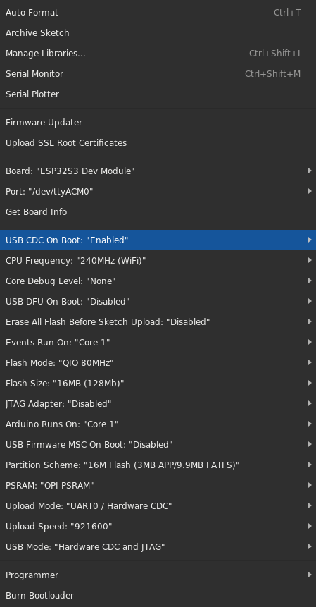

[](https://opensource.org/licenses/MIT)  [](https://webscreen.cc) [](https://deepwiki.com/HW-Lab-Hardware-Design-Agency/WebScreen-Software) [](https://www.crowdsupply.com/hw-media-lab/webscreen)

# WebScreen Software


WebScreen is a hackable, open-source gadget for gamers, makers, and creators! Get the notifications you want, build custom JavaScript apps, and stay in the zone—no distractions. Powered by ESP32-S3 with an AMOLED screen, fully open hardware and software.

The current firmware on `main` is **3.0.0**, using **LVGL 8.3.11**. It supports the WebScreen Admin and Serial IDE workflows below, including verified uploads, file downloads, app reloads, and screenshots. Use the libraries and `lv_conf.h` from the branch you build; see [Browser Tools & Firmware Compatibility](#browser-tools--firmware-compatibility).

## Core Features

### Runtime Environment
- **JavaScript Engine**: Elk JavaScript runtime with comprehensive API bindings
- **Graphics Library**: LVGL integration with RM67162 AMOLED display support
- **Storage Management**: Robust SD card handling with multiple filesystem drivers
- **Fallback System**: Built-in notification app with scrolling text and GIF animation

### Hardware Integration
- **ESP32-S3 Platform**: Full PSRAM support and optimized memory allocation
- **RM67162 Display**: 536x240 AMOLED with QSPI interface and brightness control
- **Power Management**: Smart power button handling on GPIO 21
- **Storage Interface**: SD_MMC card support with robust initialization

### Networking & Connectivity  
- **WiFi Management**: Connection handling with timeout and status monitoring
- **Secure HTTPS**: Certificate chain validation with SD card certificate storage
- **MQTT Integration**: Client support with publish/subscribe functionality
- **BLE Support**: Bluetooth Low Energy stack integration

### Development Features
- **Modular Architecture**: Separated concerns across hardware, network, and runtime modules
- **Serial Commands**: Interactive development console with comprehensive command system
- **Configuration System**: JSON-based configuration with comprehensive validation
- **Error Handling**: Robust error reporting and recovery mechanisms
- **Debug Support**: Serial logging and development utilities

## Quick Start

### Prerequisites

- **Hardware**: WebScreen PCB
- **Storage**: microSD card (formatted as FAT32)
- **Cable**: USB-C for serial communication and power
- **Software** (for compilation): Arduino IDE 2.0+

### Installation

#### Option 1: Web Flasher (Recommended for beginners)

For users who don't want to set up Arduino IDE and compile from source:

1. **Visit the Web Flasher**
   Navigate to: https://flash.webscreen.cc/

2. **Connect WebScreen**
   Connect your WebScreen device via USB-C cable

3. **Flash Firmware**
   Select the latest firmware version and click "Flash"

4. **Setup SD Card**
   Create your `webscreen.json` configuration file and JavaScript app on SD card

This is the easiest way to get started with WebScreen without any development setup.

#### Option 2: Arduino IDE (For developers)

1. **Install ESP32 Support**
   ```
   File → Preferences → Additional Board Manager URLs
   Add: https://raw.githubusercontent.com/espressif/arduino-esp32/gh-pages/package_esp32_index.json
   ```

2. **Install ESP32 Boards**
   ```
   Tools → Board Manager → Search "ESP32" → Install v3.3.2 (tested)
   ```

3. **Install Required Libraries**
   ```
   Library Manager → Install:
   - ArduinoJson (by Benoit Blanchon) - v6.x or later
   - LVGL (by kisvegabor) - v8.3.11 (this branch remains on LVGL 8)
   - PubSubClient (by Nick O'Leary) - v2.8 or later
   - NimBLE-Arduino (by h2zero) - v2.3.1 (2.x callbacks)
   ```

   In Library Manager, select **8.3.11** in LVGL's version dropdown before
   installing. This release requires LVGL 8; the migration branch uses
   LVGL 9.5. Arduino IDE shares installed libraries between Git branches, so
   switching branches does not switch LVGL automatically.

4. **Configure LVGL**
   From the repository root, copy the provided `lv_conf.h` beside the installed `lvgl` folder. Adjust the path for your Arduino sketchbook:
   ```sh
   cp lv_conf.h ~/Arduino/libraries/lv_conf.h
   ```

   Copy the configuration again whenever switching LVGL versions, then restart
   Arduino IDE. Keep backups outside `~/Arduino/libraries/` so Arduino does not
   discover both versions. Errors mentioning missing `lv_disp_drv_t`,
   `LV_IMG_CF_TRUE_COLOR_ALPHA`, or `lv_meter_t` on `main` indicate that LVGL 9
   was selected instead of LVGL 8.3.11.

   Key LVGL settings configured for WebScreen:
   - Color depth: 16-bit (RGB565) with byte swap enabled
   - Custom memory management using stdlib malloc/free
   - Display refresh: 30ms; one shared 40-line draw buffer
   - Custom monotonic clock from `esp_timer_get_time()`; no periodic 1ms interrupt
   - Snapshots enabled; screenshot storage allocated in PSRAM
   - **Enabled fonts**: Montserrat 14, 20, 28, 34, 40, 44, 48
   - **Image formats**: PNG, GIF, SJPG (BMP disabled)
   - **Widgets**: Label, Image, Arc, Line, Button, Chart, Meter, Span
   - **Layouts**: Flexbox and Grid enabled
   - Complex drawing features enabled (shadows, gradients, etc.)

5. **Open WebScreen Sketch**
   ```
   File → Open → WebScreen-Software/webscreen/webscreen.ino
   ```

6. **Board Configuration**
   - **Board**: ESP32S3 Dev Module  
   - **CPU Frequency**: 240MHz
   - **Flash Size**: 16MB (or your board's flash size)
   - **Partition Scheme**: 16M Flash (3MB APP/9.9MB FATFS), `app3M_fat9M_16MB`
   - **PSRAM**: OPI PSRAM  
   - **USB CDC On Boot**: Enabled
   - **Upload Speed**: 921600

   

7. **Compile and Upload**

   Use **Sketch → Verify/Compile**, then **Sketch → Upload**. Open Serial Monitor at **115200 baud** and run `/info` and `/help` to confirm the installed firmware and available commands. Close Serial Monitor before connecting a browser tool to the same port.

#### Option 3: Arduino CLI

After installing the libraries and copying `lv_conf.h` as above:

```sh
arduino-cli compile \
  -b esp32:esp32:esp32s3:FlashSize=16M,PartitionScheme=app3M_fat9M_16MB,PSRAM=opi,CDCOnBoot=cdc \
  --build-path /tmp/webscreen-build --warnings all -j 6 webscreen
```

See [building and testing](docs/CONTRIBUTING.md#building-and-testing) for using
an isolated LVGL 8 library, running native sanitizer tests, and device checks.

## Browser Tools & Firmware Compatibility

| Tool | Use |
|------|-----|
| [WebScreen Admin](https://admin.webscreen.cc/) · [source](https://github.com/HW-Lab-Hardware-Design-Agency/WebScreen-Admin) | Install apps, manage SD-card files, edit settings, and adjust brightness. |
| [WebScreen Serial IDE](https://github.com/HW-Lab-Hardware-Design-Agency/WebScreen-Serial-IDE) | Edit scripts, recover local drafts, upload files, use the serial console, and capture screenshots on compatible firmware. Its README includes local startup instructions. |
| [WebScreen Awesome](https://github.com/HW-Lab-Hardware-Design-Agency/WebScreen-Awesome) | Find JavaScript apps and their required configuration and media files. |

Use desktop Chrome or Edge with a USB data cable. Browser USB access requires HTTPS or localhost. Close Arduino Serial Monitor/Plotter and other Admin or IDE tabs using the device before connecting. File and settings operations require a mounted SD card.

Firmware **3.0.0** provides the following commands used by the browser tools. Run `/info` to check the installed version and `/help` to inspect its commands, especially when connecting an older device:

| Feature | Firmware 3.0.0 commands and behavior |
|---------|---------------------------|
| Verified uploads | `/upload <file> base64` and a final `[OK] File saved:` acknowledgement after `END`. |
| Reliable file browsing | `/ls <path> json`, or a text listing ending with `Total: …`. |
| IDE file opening and binary downloads | `/download <file>` with a framed base64 response. |
| Run and save as the boot app | `/load <file> save`. |
| Live JavaScript evaluation | `/eval <code>`; one line, at most 255 UTF-8 bytes. |
| App diagnostics and restart | `/errors`, `/gc`, and `/restart_app`. |
| Screenshots | `/screenshot` emitting a complete RGB565 stream while the JavaScript runtime is active. |

Use `/download <file>` to transfer an SD-card file to the computer and `/wget <url> [file]` to download from the network to the SD card. Updating a browser tool does not update the device firmware.

## Hardware Setup

### Upload Mode (if USB not detected)
1. Power off device
2. Hold **BOOT** button (behind RST button)  
3. Connect USB-C cable
4. Hold **BOOT**, press **RESET**, release **BOOT**
5. Upload firmware
6. Press **RESET** to run

### Power Button
- **Single Press**: Toggle screen on/off
- **Long Press**: Power off (hold for 3 seconds)
- **Pin**: GPIO 21 (INPUT_PULLUP)

## Configuration

WebScreen uses a JSON configuration file stored on the SD card as `/webscreen.json`. This file controls WiFi settings, display colors, MQTT configuration, and which JavaScript app to run.

### Configuration Format

**IMPORTANT:** The current firmware uses the following format with nested "settings" structure:

```json
{
  "settings": {
    "wifi": {
      "ssid": "your_wifi_network",
      "pass": "your_wifi_password"
    },
    "mqtt": {
      "enabled": false
    }
  },
  "screen": {
    "background": "#2980b9",
    "foreground": "#00fff1"
  },
  "display": {
    "brightness": 200
  },
  "script": "app.js"
}
```

### Configuration Fields

| Section | Field | Description | Default |
|---------|-------|-------------|---------|
| **settings.wifi** | `ssid` | WiFi network name | `""` |
| | `pass` | WiFi password | `""` |
| **settings.mqtt** | `enabled` | Enable MQTT functionality | `false` |
| **screen** | `background` | Background color (hex format) | `"#000000"` |
| | `foreground` | Text/foreground color (hex) | `"#FFFFFF"` |
| **display** | `brightness` | Display brightness (0-255) | `200` |
| **Root** | `script` | JavaScript file to execute | `"app.js"` |
| | `js_heap_kb` | Optional Elk arena size; positive values are clamped to 64–1024 KB | Firmware default |
| **Root** | `timezone` | Timezone setting; also accepts `system.timezone` | `"UTC"` |
| **system** | `ntp_server` | Time server used after WiFi connects | `"pool.ntp.org"` |

### Editing Settings in WebScreen Admin

Connect the device and open **Settings** to load `/webscreen.json`. The saved WiFi password is masked; use the eye button to inspect it. Brightness changes are sent live, while **Save settings** stores the selected value for startup. Restart the device to apply other saved settings.

Under **Advanced → Add property**, enter a name, type, and value, such as `settings.weather.city` (Text), `refresh_seconds` (Number), or `notifications_enabled` (Boolean). Dots create nested objects. Existing custom properties load into the form and can be edited or removed. **View webscreen.json** previews the complete document before saving.

Custom properties must be read explicitly by your app, for example with `sd_read_file('/webscreen.json')` and the JSON helpers documented in [docs/API.md](docs/API.md). Keep configuration small: this branch's startup loader uses a 1 KB ArduinoJson document with ArduinoJson 6; ArduinoJson 7 uses dynamic allocation. A successful save does not prove the firmware can parse a larger document at boot.

For nested settings, edit the complete JSON file or use Admin. This branch's `/config get` traverses nested paths, but `/config set` only splits the first dot and stores values as strings; it cannot safely replace a typed, deeply nested configuration editor.

### Example Configurations

#### Basic WiFi Setup
```json
{
  "settings": {
    "wifi": {
      "ssid": "MyNetwork",
      "pass": "MyPassword"
    }
  },
  "script": "app.js"
}
```

#### Custom Colors
```json
{
  "settings": {
    "wifi": {
      "ssid": "MyNetwork",
      "pass": "MyPassword"
    }
  },
  "screen": {
    "background": "#1a1a2e",
    "foreground": "#eeeeee"
  },
  "script": "weather.js"
}
```

#### With MQTT Enabled
```json
{
  "settings": {
    "wifi": {
      "ssid": "MyNetwork",
      "pass": "MyPassword"
    },
    "mqtt": {
      "enabled": true
    }
  },
  "script": "mqtt_dashboard.js"
}
```

#### Minimal Configuration (WiFi Only)
```json
{
  "settings": {
    "wifi": {
      "ssid": "MyNetwork",
      "pass": "MyPassword"
    }
  }
}
```

**Note:** WebScreen will start in fallback mode (displaying the notification screen) if:
- No `/webscreen.json` configuration file is found on the SD card
- The JavaScript file specified in the `script` field doesn't exist on the SD card
- The SD card cannot be mounted

**Important:** If WiFi configuration is missing or WiFi connection fails, WebScreen will still execute the JavaScript application (if the script file exists). This allows offline applications to run without network connectivity.

## Architecture & Building

### System Architecture

WebScreen features a modular architecture with clear separation of concerns:

```
┌─────────────────────────────────────────────────────────────┐
│                    Application Layer                        │
│  ┌─────────────────┐    ┌─────────────────┐                │
│  │  JavaScript     │    │   Fallback      │                │
│  │   Runtime       │    │     App         │                │
│  └─────────────────┘    └─────────────────┘                │
├─────────────────────────────────────────────────────────────┤
│                      Runtime Management                    │
│  ┌─────────────────────────────────────────────────────────┐│
│  │           webscreen_runtime.cpp/.h                     ││
│  │  • LVGL initialization and management                   ││
│  │  • Elk JavaScript engine integration                   ││
│  │  • Task management and execution                       ││
│  │  • Memory filesystem drivers                           ││
│  └─────────────────────────────────────────────────────────┘│
├─────────────────────────────────────────────────────────────┤
│                    Core Application                        │
│  ┌─────────────────────────────────────────────────────────┐│
│  │             webscreen_main.cpp/.h                      ││
│  │  • Configuration loading and management                ││
│  │  • Shared settings storage                             ││
│  │  • Boot coordinated by webscreen.ino                    ││
│  └─────────────────────────────────────────────────────────┘│
├─────────────────────────────────────────────────────────────┤
│                  Hardware Abstraction                      │
│  ┌─────────────────────────────────────────────────────────┐│
│  │           webscreen_hardware.cpp/.h                    ││
│  │  • SD card initialization with retry logic             ││
│  │  • Power button handling                               ││
│  │  • Display management                                  ││
│  │  • Pin configuration and GPIO control                  ││
│  └─────────────────────────────────────────────────────────┘│
├─────────────────────────────────────────────────────────────┤
│                     Network Layer                          │
│  ┌─────────────────────────────────────────────────────────┐│
│  │            webscreen_network.cpp/.h                    ││
│  │  • WiFi connection with timeout handling               ││
│  │  • HTTPS client with certificate validation            ││
│  │  • MQTT client integration                             ││
│  │  • BLE stack management                                ││
│  └─────────────────────────────────────────────────────────┘│
└─────────────────────────────────────────────────────────────┘
```

### Build Process

#### Arduino IDE Build
```
1. Open Arduino IDE
2. File → Open → webscreen/webscreen.ino  
3. Select ESP32S3 Dev Module board
4. Configure board settings (see installation guide)
5. Click Upload button
```

#### LVGL Configuration
WebScreen includes a custom `lv_conf.h` file optimized for ESP32-S3 with AMOLED display:

**Display Settings:**
- **Color Format**: 16-bit RGB565 with byte swapping for SPI compatibility
- **Resolution**: 536x240 pixels
- **DPI**: 130 for optimal widget sizing
- **Refresh Rate**: 30ms for stable display output

**Available Fonts (Montserrat):**
| Size | Usage |
|------|-------|
| 14 | Default, small text |
| 20 | Body text |
| 28 | Subheadings |
| 34 | Medium headings |
| 40 | Large headings |
| 44 | Extra large |
| 48 | Display text |

**Note:** Other font sizes (8, 10, 12, 16, 18, 22, 24, etc.) are NOT available.

**Enabled Widgets:**
- **Core**: Label, Image, Arc, Line, Button, Button Matrix, Canvas
- **Extra**: Chart, Meter, Message Box, Span (rich text)
- **Layouts**: Flexbox and Grid

**Supported Image Formats:**
- PNG ✅, GIF ✅, SJPG ✅, BMP ❌

**Performance Optimizations:**
- Image caching disabled to save RAM
- Gradient caching disabled to reduce memory usage
- Shadow caching disabled for predictable memory consumption
- Memory management uses ESP32 heap allocator

#### Build Verification

Compile before uploading, then check startup output at 115200 baud. Record the firmware commit, ESP32 board package, LVGL version, and board settings when reporting a problem. A successful compile still requires hardware checks for display output, SD-card access, networking, and the affected JavaScript APIs.

### Runtime Modes

| Mode | Trigger | Description |
|------|---------|-------------|
| **JavaScript** | Valid configuration and the file named by `script` exist | Runs the app with the firmware's Elk API bindings; WiFi is optional. |
| **Fallback** | SD card cannot mount, configuration cannot be read/parsed, the script is missing, or runtime initialization fails | Built-in notification app with GIF animation; serial remains available. |
| **JavaScript safe mode** | Repeated app failures exhaust automatic recovery | App execution is paused; inspect `/errors`, upload a correction, then `/load` or `/restart_app`. |

### Development & Debugging

#### Serial Monitor Output
```
[1234.567] INFO: [Main] WebScreen v3.0.0 initializing...
[1234.678] INFO: [Memory] PSRAM: 8388608 bytes available
[1234.789] INFO: [Display] RM67162 initialized (536x240)
[1234.890] INFO: [WiFi] Connected to MyNetwork (192.168.1.100)
[1234.991] INFO: [JavaScript] Loaded /apps/weather.js (2.4KB)
```

#### Serial Commands

WebScreen includes a comprehensive serial command system for interactive development. Storage and configuration commands work in fallback and JavaScript modes. `/load`, `/restart_app`, `/eval`, and `/screenshot` require the JavaScript runtime:

**Core Commands:**
```
/help                    - Show all available commands
/stats                   - Display system statistics (memory, storage, WiFi)
/info                    - Show device information and version
/write <filename>        - Interactive JavaScript editor
/load <script.js> [save] - Switch app in place; save also persists the boot app
/restart_app             - Restart the current JavaScript app without reboot
/eval <code>             - Evaluate one line in the running app
/errors                  - Show JavaScript errors and recovery state
/gc                      - Request JavaScript garbage collection
/screenshot              - Capture the display as base64 RGB565
/brightness <0-255>      - Set display brightness (no args to query current)
/time                    - Show device time
/settime <epoch> [tz]    - Set device time and optional timezone
/reboot                  - Restart the device
```

**Network & Monitoring:**
```
/wget <url> [file]       - Download file from URL to SD card
/ping <host>             - Test network connectivity
/monitor [cpu|mem|net]   - Live system monitoring (press any key to stop)
```

**Configuration Management:**
```
/config get <key>        - Get configuration value
/config set <key> <val>  - Set configuration value
/backup [save|restore]   - Backup or restore configuration
```

**File Operations:**
```
/ls [path] [json]        - List files/directories; json gives structured output
/cat <file>              - Display file contents
/rm <file|empty-dir>     - Delete file or empty directory
/mkdir <path>            - Create an SD-card directory
/download <file>         - Transfer an SD-card file as framed base64
/upload <file> [base64]  - Receive file data until a line containing END
```

Use base64 uploads to preserve blank lines, indentation, Unicode, and a literal `END` in file contents. The browser tools encode and pace chunks automatically, then wait for the device acknowledgement.

**Example Development Workflow:**
```
WebScreen> /write hello.js
Enter JavaScript code. End with a line containing only 'END':
---
+ create_label_with_text('Hello WebScreen!');
+ END
[OK] Script saved: /hello.js (45 bytes)

WebScreen> /load /hello.js save
[OK] Loading script: /hello.js
[OK] Config updated: script = /hello.js
```

While JavaScript is active, `/load /hello.js` switches apps for the current session without rebooting; add `save` to run it after the next boot as well. If the device is in fallback mode, set `/config set script /hello.js` and then `/reboot` to start the JavaScript runtime.

For detailed command reference, see [docs/SerialCommands.md](docs/SerialCommands.md).

#### Performance Monitoring

Use the serial console to inspect memory, storage, and network status:

```text
/stats
/monitor mem
/monitor net
```

Press a key to leave monitoring before issuing another command. `/errors` reports JavaScript failures and `/gc` requests garbage collection at a safe point.

## JavaScript API

### Elk Compatibility

Apps run in the Elk interpreter bundled in [webscreen/elk.c](webscreen/elk.c). Use `let`, function expressions such as `let refresh = function() { ... };`, and bounded `for` loops. This interpreter reports `while`, `const`, `var`, classes, and `switch` as not implemented. Browser or Node.js execution alone does not validate firmware compatibility.

Schedule repeated work with a named callback, such as `create_timer('refresh', 1000)`, and keep callbacks short so display updates can continue. Follow each app's setup instructions in [WebScreen Awesome](https://github.com/HW-Lab-Hardware-Design-Agency/WebScreen-Awesome) and include its required assets on the SD card.

### Available Bindings

The firmware exposes numerous functions to your JavaScript applications. Some highlights include:
- **Basic:** `print()`, `delay()`
- **Wi‑Fi:** `wifi_connect()`, `wifi_status()`, `wifi_get_ip()`
- **HTTP:** `http_get()`, `http_post()`, `http_delete()` (all support custom ports like `http://host:port/path`), `http_set_ca_cert_from_sd()`, `parse_json_value()`
- **SD Card:** `sd_read_file()`, `sd_write_file()`, `sd_list_dir()`, `sd_delete_file()`
- **BLE:** `ble_init()`, `ble_is_connected()`, `ble_write()`
- **Display:** `set_brightness()`, `get_brightness()`
- **UI Drawing:** `draw_label()`, `draw_rect()`, `show_image()`, `create_label()`, `label_set_text()`
- **Image Handling:** `create_image()`, `create_image_from_ram()`, `rotate_obj()`, `move_obj()`, `animate_obj()`
- **Styles & Layout:** `create_style()`, `obj_add_style()`, `style_set_*()`, `obj_align()`
- **Advanced Widgets:** Meter, Message Box, Span, Window, TileView, Line
- **MQTT:** `mqtt_init()`, `mqtt_connect()`, `mqtt_publish()`, `mqtt_subscribe()`, `mqtt_loop()`, `mqtt_on_message()`

For a full list and examples of usage, see the [JavaScript API Reference](docs/API.md).
For timer scheduling, resource limits, MQTT polling, and recovery, see
[Writing reliable JavaScript apps](docs/JS_APPS.md).

## Secure HTTPS Connections

To call secure APIs (e.g., using `http_get()`), load a full chain certificate stored on the SD card using:
```js
http_set_ca_cert_from_sd("/timeapi.pem");
```
### Creating a Full Chain Certificate
1. **Obtain Certificates:**  
   Collect your server certificate and the intermediate certificate(s). Optionally, include the root certificate.
2. **Concatenate Certificates:**  
   Use a text editor or command-line tool:
   ```bash
   cat server.crt intermediate.crt root.crt > fullchain.pem
   ```
   Ensure each certificate block starts with `-----BEGIN CERTIFICATE-----` and ends with `-----END CERTIFICATE-----`.
3. **Deploy:**  
   Copy the resulting `fullchain.pem` file to the SD card.
4. **Usage:**  
   Your JavaScript app should load it with `http_set_ca_cert_from_sd()` to enable secure HTTPS requests.

## Contributing & Support

### For Developers

The repository includes native regression tests against real LVGL and Elk, plus a script for device checks. Run the host suite with Python 3, GCC/G++, sanitizer runtimes, and LVGL 8.3.11 installed:

```sh
python3 tests/run_host_tests.py \
  --lvgl /path/to/lvgl-8.3.11 \
  --build-dir /tmp/webscreen-lvgl8-tests
```

For device checks, copy [tests/firmware_smoke.js](tests/firmware_smoke.js) to the SD card, run `/load /firmware_smoke.js`, and monitor `/stats` during repeated `/restart_app` cycles. See [Building and Testing](docs/CONTRIBUTING.md#building-and-testing) for prerequisites and validation details. Host and browser tests do not replace firmware compilation and hardware testing.

#### Getting Started
1. **Read the Docs**: Check out [docs/CONTRIBUTING.md](docs/CONTRIBUTING.md) for detailed guidelines
2. **Set Up Environment**: Follow the development setup instructions
3. **Pick an Issue**: Look for "good first issue" labels on GitHub
4. **Submit PR**: Follow our contribution workflow

#### Key Areas for Contribution
- **Performance**: Memory optimization, rendering improvements
- **Hardware Support**: New display drivers, sensor integration  
- **Network**: Protocol implementations, connectivity features
- **Documentation**: API docs, tutorials, examples
- **Testing**: Unit tests, integration tests, hardware testing

### Getting Help

| Type | Resource | Description |
|------|----------|-------------|
| 🐛 **Bug Reports** | [GitHub Issues](https://github.com/HW-Lab-Hardware-Design-Agency/WebScreen-Software/issues) | Report bugs and request features |
| 💬 **Discussions** | [GitHub Discussions](https://github.com/HW-Lab-Hardware-Design-Agency/WebScreen-Software/discussions) | Ask questions and share ideas |
| 📖 **Documentation** | [docs/](docs/) | API reference and guides |
| 🌐 **Website** | [WebScreen.cc](https://webscreen.cc) | Official project website |
| 🛒 **Hardware** | [CrowdSupply](https://www.crowdsupply.com/hw-media-lab/webscreen) | Purchase WebScreen hardware |

### Support the Project

If WebScreen has been useful for your projects:

- ⭐ **Star the repo** to show your support
- 🍴 **Fork and contribute** to make it better  
- 🐛 **Report issues** to help us improve
- 📖 **Improve documentation** for other users
- 💰 **Sponsor development** to fund new features

## License

This project is open source. See the [LICENSE](LICENSE) file for details.
